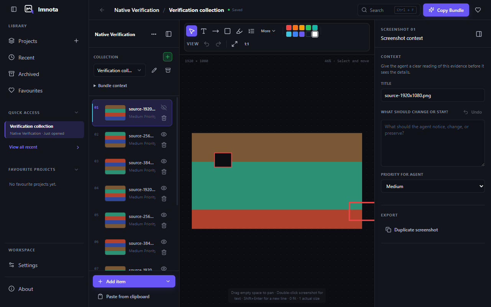
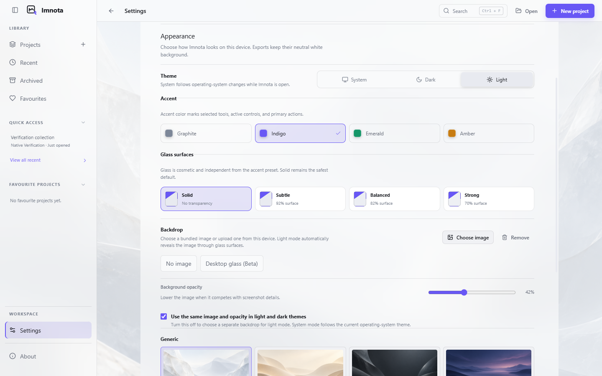
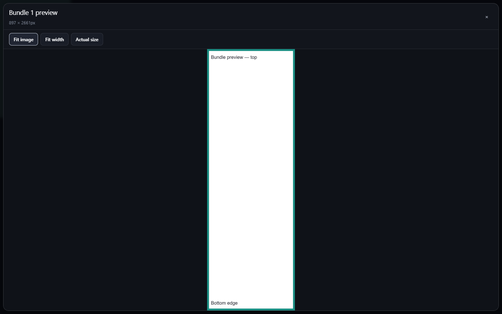

# UI improvements — nightly feedback, 9 September 2026

## Status and scope

**Implemented after Dylan authorized execution on 9 September 2026.** The eight scoped PRs are reviewable; none has been merged or released. Four GPT ImageGen backgrounds are included, and the original girl presets remain selectable. The numbered sections retain the agreed implementation brief; the completion record below describes work and checks actually performed.

This document covers both feedback bundles in full:

- `Feedback after UI Changes - 260909-010456 - 01`: Pictures 1–8, including Picture 4 / Note 1.
- `Feedback after UI Changes - 260909-010547 - 02`: Pictures 9–14, including Drawing 11.

All supplied feedback has Medium priority. The sequence below follows dependencies and review boundaries, rather than implying different user priorities. This feedback supersedes conflicting proposals in `appUIoverhaul.md`, such as adding inclusion labels, an Annotate heading, and a Danger zone.

**Confirmed clarification:** the screenshots show the current nightly, not stable. The current workspace is an older feature checkout (`feature/mixed-content-implementation`, `5070dc0`). For planning, `origin/main` was fetched and inspected at `6215c64`; it contains the reported UI. The nightly workflow builds an immutable commit from `main`. This is a source baseline, not a claim that `6215c64` is the exact installed nightly. Before implementation, record the installed nightly version and its source SHA when available, then reproduce on current main. Do not port these fixes onto the older feature checkout.

## Complete feedback map

| Reference                      | Requested result                                                                                                                                                                     | PR  |
| ------------------------------ | ------------------------------------------------------------------------------------------------------------------------------------------------------------------------------------ | --- |
| Picture 1                      | Back and Forward sit next to each other without clipping.                                                                                                                            | 1   |
| Picture 2                      | Rename collection and other popups use the app viewport for centered placement, with fully reachable content and actions.                                                            | 2   |
| Picture 3                      | Remove the inspector's inclusion explanation/control block; the existing eye provides inclusion control and state.                                                                   | 3   |
| Picture 4                      | Remove Included / Excluded row text; retain the eye indicator.                                                                                                                       | 3   |
| Picture 4 / Note 1             | Add a trash button to each item row.                                                                                                                                                 | 3   |
| Picture 5                      | Remove the Danger zone section from the inspector.                                                                                                                                   | 3   |
| Picture 6                      | Remove the highlighted Evidence collection heading and the `4/5 included` summary.                                                                                                   | 3   |
| Picture 7                      | Open bundle previews across the available app viewport and show the whole image without cropping.                                                                                    | 2   |
| Picture 8                      | Restore visibly transparent backdrop surfaces; remove the stronger tint regression. Light theme plus an image automatically uses in-app glass. Preserve the earlier dark appearance. | 7   |
| Picture 8 + additional request | Generate generic backdrops with GPT ImageGen, including real light-mode artwork; preserve girl options.                                                                              | 8   |
| Picture 9                      | Remove the stale delete-undo banner and its Undo delete button.                                                                                                                      | 4   |
| Picture 10                     | Remove visible Annotate text; dismiss tooltips correctly after tool selection and pointer departure.                                                                                 | 5   |
| Drawing 11                     | Keep the supplied circle/diamond drawing as reference material for the canvas comparison; no separate requested feature is stated.                                                   | 6   |
| Picture 12                     | Match the drawing canvas background to the screenshot canvas in the active theme.                                                                                                    | 6   |
| Picture 13                     | Replace the header item count with save status; move inspector collapse into the panel it collapses.                                                                                 | 1   |
| Picture 14                     | With side navigation collapsed, put its restore button at the left and Back/Forward beside the title.                                                                                | 1   |

## PR 1 — Navigation placement and editor header space

**Proposed title:** `fix(ui): align navigation and relocate editor status`

**Primary files:** `src/renderer/app/AppShell.tsx`, `app/SideNav.tsx`, `app/Workspace.tsx`, `App.tsx`, `styles.css`, plus the corresponding component tests. Renderer-relative paths throughout this plan refer to `src/renderer/` unless stated otherwise.

1. Give Back/Forward an explicit horizontal, nonwrapping layout with nonshrinking icon buttons. Keep navigation state and history behavior intact.
2. When navigation is collapsed, use this order: navigation restore → Back → Forward, when available → project/collection title. Keep safe window-edge padding and native window-control clearance.
3. Replace the collection title's item-count slot with the existing real save state. Remove the duplicate status from the canvas toolbar.
4. Pass the correct persistence state into the header for screenshots, drawings, and text. Display Saving…, Saved, and Save failed honestly; preserve the existing retry route. A failed pending save must not become Saved merely because the selected item changed.
5. Put the inspector collapse action inside its header, consistently for screenshot, drawing, and text inspectors. When collapsed, expose a compact restore control at the right panel boundary. Do not reserve a permanent toolbar column for the expanded panel's collapse control.
6. Preserve drawer focus return and Escape behavior at narrow widths. Long titles truncate before controls are pushed offscreen.

**Acceptance:** Back/Forward remain adjacent and fully clickable; collapsed side navigation restores from the leftmost control; save status replaces item count; inspector collapse belongs to the inspector; the toolbar gains usable width. Verify navigation open/closed, inspector open/closed, long names, save success/in-progress/error, and each content type.

**Dependency:** none. This PR establishes the header layout used by subsequent visual checks.

## PR 2 — Viewport-level dialogs and full-space previews

**Proposed title:** `fix(ui): center dialogs and expand bundle previews`

**Primary files:** `components/ui.tsx`, `collection/CollectionRail.tsx`, `app/AppDialogs.tsx`, `export/PromptBundleDialogHost.tsx`, `export/prompt-bundles.css`, `styles.css`, modal/export tests.

1. Render shared modal overlays in a viewport-level portal outside panel clipping and glass/filter containing blocks. Inspect the actual stacking context before choosing the portal host.
2. Give ordinary forms an appropriate readable width, centered against the entire app viewport, with responsive outer margins. “Use the whole screen” means access to the full viewport for placement; a rename form does not need a screen-wide text field.
3. Constrain tall forms to the viewport and scroll their body while keeping close and submit/cancel actions reachable. Preserve input validation, focus trapping, Escape, backdrop dismissal, and return focus.
4. Add a full-space preview variant occupying the available app content viewport with a small margin and compact header. Do not invoke operating-system fullscreen.
5. Initially fit the complete image within the preview using its natural aspect ratio, without cover/cropping. Offer fit-width and actual-size inspection with scrolling or panning so very tall bundles remain readable. Keep all image edges reachable when zoomed.
6. Keep previews tied to the original bundle image; do not alter export dimensions or contents to repair display layout.

**Acceptance:** rename input and both actions are visible with either side panel collapsed or expanded. A tall bundle comparable to Picture 7 is fully visible in fit mode and inspectable at readable scale; wide images also work. Closing preview returns to bundle selection, and closing a dialog returns focus to its opener. Verify with glass enabled because it can change overlay containment.

**Dependency:** none; shared modal and preview work belongs in one PR because the clipping fix is shared.

## PR 3 — Collection and inspector cleanup with direct deletion

**Proposed title:** `fix(ui): simplify inclusion controls and add item trash actions`

**Primary files:** `collection/CollectionRail.tsx`, `inspector/ScreenshotInspector.tsx`, `app/Workspace.tsx`, `App.tsx`, relevant styles and collection/inspector tests.

1. Remove the full redundant Included/Excluded in prompt bundle block and explanatory text shown in Picture 3. Keep duplication accessible.
2. Remove Included/Excluded text badges from collection rows. Preserve eye/eye-off state and its working export inclusion toggle. Give the icon an accessible action name and state, without reintroducing visible explanatory copy.
3. Add a trash icon next to the eye in every screenshot, drawing, and text row. Delete the row that was clicked, including an unselected row. Prevent the action from starting drag/reorder or accidentally selecting another item.
4. Reuse existing type-appropriate deletion handlers and confirmation/error behavior. Handle pending saves, failed deletion, selection after deletion, and the last item. This PR does not invent a new deletion backend or change file retention.
5. Remove the inspector Danger zone container, heading, helper text, and duplicated item delete control. Keep project deletion reachable through the existing project-level action; verify that route before removing the inspector route. If no suitable route exists on the execution baseline, add a concise Delete project action in the project menu in this same PR.
6. Remove only the highlighted Evidence collection heading and included-count summary from Picture 6. Keep the project/collection identity, selection, rename/archive, add-item, and collapse controls.
7. Remove newly empty section wrappers or spacing left by deleted copy.

**Acceptance:** all marked text is absent; eye toggles still change exported inclusion; every row has working trash; row deletion does not delete the active item by mistake; project deletion remains discoverable at project level. Verify all three item types and failed deletions. Keep meaningful failure messages and data intact.

**Dependency:** coordinate shared `Workspace.tsx` and shell styles with PR 1. Obtain independent review if deletion/persistence behavior changes, as required by the repository working agreement.

## PR 4 — Remove the ineffective delete-undo banner

**Proposed title:** `fix(ui): remove stale delete recovery banner`

**Primary files:** `App.tsx`, its tests, and banner-specific state/styles where genuinely unused.

1. Remove the banner shown in Picture 9: “A previously deleted screenshot can still be restored,” Undo delete, and its dismiss button.
2. Trace every route that recreates this banner, including reopening a project or restoring recovery state. Remove the banner's presentation wiring so it cannot return after restart.
3. Remove dead banner-only code after checking other consumers. Preserve stored recovery data and any separately working recovery route.
4. Keep annotation/drawing undo and redo intact. The requested removal refers to the screenshot-delete banner, not editing history.

**Acceptance:** no stale banner on initial open, after deleting an item, when changing project, or after reload. Ordinary canvas undo/redo still works. Adjust existing banner tests to assert the requested absence and retain recovery tests for retained capabilities.

**Dependency:** land after PR 3 so the new direct delete interaction can be checked end to end.

## PR 5 — Compact annotation toolbar and correct tooltip lifecycle

**Proposed title:** `fix(ui): dismiss tooltips after selection and compact toolbar`

**Primary files:** `components/Toolbar.tsx`, `components/annotation-tools.css`, toolbar tests.

1. Remove the visible Annotate group label while retaining an accessible group name.
2. Replace the sticky focus-within visibility behavior with a lifecycle that distinguishes pointer hover from keyboard focus. Current nightly CSS displays tooltips for both `:hover` and `:focus-within`, explaining why pointer selection can leave the description open.
3. Hide the description on tool activation and pointer departure; do not allow retained click focus to reopen it. A new hover can show it again after the normal delay.
4. Preserve keyboard discovery, focus rings, and shortcuts. Escape dismisses the tooltip without deselecting the tool or stealing focus.
5. Keep tooltip positioning within the visible viewport at toolbar edges and under overflow menus.

**Acceptance:** reproduce hover → click → move away, and hover → move away without clicking. Both dismiss correctly. Clicking a tool does not require another toolbar click to clear its description. Keyboard users can still identify tools. Verify fast movement between tools and narrow toolbar widths.

**Dependency:** PR 1 provides the final toolbar space; implementation can be developed independently in these component files.

## PR 6 — Match drawing and screenshot canvas surfaces

**Proposed title:** `fix(ui): match drawing canvas to screenshot workspace`

**Primary files:** `content/DrawingEditor.tsx`, `content/content-editors.css`, `content/drawing-render.ts`, `components/annotation-canvas.css`, theme tokens and drawing render tests as needed.

1. Compare the screenshot canvas workspace background with Excalidraw's rendered background in each theme. Use the screenshot workspace surface as the reference for Picture 12, not the pixels inside an imported screenshot.
2. Map the drawing editor's display background to the same theme value, accounting for Excalidraw's dark-theme color transformation. Avoid a one-off near-black that still differs from the screenshot canvas.
3. Keep this a display treatment. Preserve drawing source meaning, user-created fills/strokes, and neutral export background. Inspect save serialization so a theme switch does not silently rewrite artwork or introduce autosaves.
4. Use Drawing 11's circle and diamond to compare editor appearance and exported output. No new shape tools are requested by that reference.

**Acceptance:** adjacent screenshot and drawing workspaces match in dark mode and use corresponding light surfaces in light mode. Theme switching does not recolor stored artwork, dirty the drawing, or change the exported image. Existing drawing loading, editing, and save behavior still works.

**Dependency:** independent of other component fixes; coordinate the shared theme token with PR 7.

## PR 7 — Restore transparency and automatic light backdrop glass

**Proposed title:** `fix(appearance): restore backdrop visibility and light glass`

**Primary files:** `app/useAppearance.ts`, `styles.css`, `settings/settings.css`, `settings/AppearanceSettings.tsx`, `src/shared/preferences.ts` only if required, appearance tests.

1. Inspect appearance history to find the earlier dark transparency treatment Dylan preferred. Current main has fixed 88% dark / 94% light chrome surface overrides and 92% / 96% library/settings overrides; these can obscure the image regardless of the selected glass strength. Remove the regression using the earlier behavior as reference, then verify rendered results.
2. Derive in-app glass from resolved light theme plus an active bundled or uploaded background. It should become active immediately when either condition changes, including System theme switching to light.
3. This glass reveals the app's own background image. It must not activate Electron desktop transparency, change native window material, or expose other desktop windows. Keep existing desktop-glass behavior separate.
4. Use restrained neutral translucent surfaces so the image is recognizably visible without a strong accent-colored wash. Tune opacity and blur visually with both light and dark artwork; avoid simply brightening the old dark portraits as the light-mode solution.
5. Preserve the earlier dark look and existing dark user choices after restoring the regression. Leaving light mode must not persist its automatic glass choice into dark settings.
6. Removing the image returns light mode to its normal no-image presentation. Preserve reduced-transparency and explicit host performance fallbacks.
7. Keep screenshot pixels, drawing/export surfaces, and exported bundles independent of decorative backdrops.

**Proposed preference rule for review:** light + active image enables effective glass even if the ordinary cosmetic preset was Solid, while accessibility/performance fallbacks still win. Derive this at display time rather than overwriting stored dark preferences. This follows the requested automatic behavior; document any necessary preference migration before implementation.

**Acceptance matrix:** light/dark/System × no image/bundled/uploaded × navigation and inspector open/closed. Verify settings and library as well as the editor. Background is visible through chrome; labels and focus rings remain readable; no native desktop-glass activation occurs; switching themes or removing images restores the intended state. Check a bright and a dark uploaded image and reduced transparency.

**Dependency:** PR 6 establishes the canvas surface boundary. PR 8 supplies final artwork, after which repeat affected appearance screenshots with those assets.

## PR 8 — GPT ImageGen generic backdrop collection

**Proposed title:** `feat(appearance): add generic light and dark backdrops`

**Primary files:** `public/backdrops/`, `settings/AppearanceSettings.tsx`, `app/useAppearance.ts`, `src/shared/preferences.ts`, relevant preference validation/tests, `docs/backdrop-artwork.md`.

1. Generate four separate finished images with the built-in GPT ImageGen tool after execution is authorized. Proposed set: Mist light, Sand light, Slate dark, and Dusk dark. These are neutral abstract options, with no people, text, logos, or baked-in UI.
2. Aim for wide 16:9 compositions, approximately 2560 × 1440 or the closest supported landscape output. Keep the central working area quiet and detail low; the artwork must tolerate different window crops.
3. Use the following prompt briefs, expanding them into final prompts at generation time and recording the exact prompts in the artwork document:

| Asset      | GPT ImageGen brief                                                                                                                                                                                           |
| ---------- | ------------------------------------------------------------------------------------------------------------------------------------------------------------------------------------------------------------ |
| Mist light | Stylized abstract desktop wallpaper; broad translucent mineral forms, pearl white and pale cool grey, soft daylight, subtle depth, very low visual noise, quiet center, wide landscape, no text/people/UI.   |
| Sand light | Stylized abstract desktop wallpaper; softly layered sand and ivory contours, warm diffuse daylight, restrained contrast and spacious composition, quiet center, wide landscape, no text/people/UI.           |
| Slate dark | Stylized abstract desktop wallpaper; broad graphite and slate forms, subdued silver illumination, gentle tonal depth without crushed black or bright glare, quiet center, wide landscape, no text/people/UI. |
| Dusk dark  | Stylized abstract desktop wallpaper; muted indigo atmospheric layers, restrained violet light, smooth low-detail composition, quiet center, wide landscape, no text/people/UI.                               |

4. Inspect every generated image on its own and behind the actual light/dark app chrome. Revise assets that compete with text or vanish behind the glass treatment.
5. Save project assets inside the repository with new descriptive identifiers. Preserve existing graphite/indigo/emerald/amber girl artwork, preset IDs, and saved selections. Present clear Generic and Characters groupings in the picker; keep uploads and No image available.
6. Keep selection explicit: adding new presets must not automatically replace someone's existing image. Light artwork should be offered as actual separate presets, not a filter over the girl images.
7. Check decoded dimensions, packaged size, load behavior, and supported preference values. Use the existing asset pipeline and file formats where practical. Include source/provenance, exact prompts, and final paths in `docs/backdrop-artwork.md`.

**Acceptance:** four distinct generic assets available locally, at least two designed for light mode; all existing girl choices remain functional after upgrade/restart; uploads still work; assets load in the packaged app; no backdrop appears in exports. Each asset is visibly checked under PR 7's glass surfaces.

**Dependency:** PR 7 before final integration. Asset generation can run in a separate thread while other approved implementation proceeds.

## Execution and PR workflow

1. Execution was authorized by Dylan's instruction to execute. Implement the agreed UI scope; merging and release publication remain separate.
2. Use isolated worktrees from current main to preserve the existing dirty feature checkout. Check applicable `AGENTS.md` in each implementation worktree.
3. Reproduce the nightly feedback and capture before screenshots, including the earlier dark appearance baseline from history where available. Record exact revisions and viewport sizes.
4. Implement the eight PR outcomes above. Suggested landing order: **1 → 2 → 3 → 4 → 5 → 6 → 7 → 8**. Do not put all changes into one umbrella PR.
5. Optional parallel threads after authorization: modal/preview work, toolbar/drawing work, and backdrop generation can proceed alongside shell/collection work. Give each thread a bounded file scope; serialize shared `App.tsx`, `Workspace.tsx`, theme, and global stylesheet edits. Rebase dependent PRs after earlier changes land.
6. Each PR description links its feedback picture numbers, describes visible before/after behavior, includes targeted test results and rendered comparison screenshots, and states any remaining limitation. Keep changes independently revertible; explain any unavoidable dependency in the PR.
7. Apply the repository's required checks from the execution baseline. For app behavior, run lint, typecheck, focused regression tests, and the full application suite before merge as required by `AGENTS.md`; use `pnpm build` and packaged/native checks where the change crosses those paths. Do not alter CI routing to avoid checks.
8. Do not publish a stable release as part of this nightly UI task. PR creation, merging, and nightly publication follow the scope of the later execution instruction; record what is ready without assuming release permission.

## Final verification and completion record

Use actual supported desktop window sizes, including a compact window, a normal laptop viewport, and a wide desktop. Check 100%, 125%, and 150% display/zoom configurations where supported. Cover long collection names and the tall preview supplied in the feedback. Include native window-control clearance on platforms affected by header placement; distinguish rendered browser checks from native checks actually performed.

Regression coverage should target real behavior: tooltip dismissal after click, correct row deletion, dialogs escaping clipped parents, preview fitting, accurate save-state propagation, and automatic theme/backdrop transitions. Pure text/spacing removal needs visual inspection and adjusted existing assertions rather than a separate test for every deleted word.

| Plan PR                          | Status                                           | Pull request                                      |
| -------------------------------- | ------------------------------------------------ | ------------------------------------------------- |
| 1 - Navigation and header        | Implemented, independently reviewed              | [#44](https://github.com/Dytschgo/imnota/pull/44) |
| 2 - Dialogs and preview          | Implemented, independently reviewed              | [#45](https://github.com/Dytschgo/imnota/pull/45) |
| 3 - Collection cleanup and trash | Implemented, independently reviewed              | [#46](https://github.com/Dytschgo/imnota/pull/46) |
| 4 - Delete banner removal        | Implemented and regression-tested                | [#47](https://github.com/Dytschgo/imnota/pull/47) |
| 5 - Toolbar and tooltips         | Implemented, independently reviewed              | [#48](https://github.com/Dytschgo/imnota/pull/48) |
| 6 - Drawing canvas               | Implemented, independently reviewed              | [#49](https://github.com/Dytschgo/imnota/pull/49) |
| 7 - Glass and transparency       | Implemented, independently reviewed              | [#50](https://github.com/Dytschgo/imnota/pull/50) |
| 8 - Generic backdrops            | Generated, integrated and independently reviewed | [#51](https://github.com/Dytschgo/imnota/pull/51) |

Completion means every feedback-map entry has a corresponding verified result. Any materially unclear behavior is clarified with Dylan one question at a time; the confirmed nightly baseline does not need to be asked again. Drawing 11 is treated as reference only unless Dylan supplies a separate request for it.

### Execution evidence

Implementation used separate worktrees from main at `6215c64`, preserving the original dirty feature checkout. PR 3 is stacked on PR 1, PR 4 on PR 3, and PR 8 on PR 7. Other PRs target main independently. A local integration branch `review/ui-feedback-20260909` combines all eight for verification without an umbrella PR.

- Initial combined application suite: 591 tests in 80 files passed. Script suite: 42 passed, with the packaged macOS test skipped on Windows.
- Combined lint, typecheck and production build passed. The final small settings-label correction also passed 36 focused appearance/preference tests, lint and typecheck.
- Windows Electron native walkthrough: 18 assertion groups passed with compiled production assets, including drawing/text editing, viewport/theme transitions, export checks and all eight backdrop presets. This is unpackaged Windows evidence; macOS/Linux native and distributable verification remain CI/release checks.
- Dialog fixture: 24 rendered states at 1280x800, 800x600 and 640x480, including tall forms and tall/wide previews at fit, width and actual scale.
- Header/collection fixture: eight rendered navigation/viewport states at 1440, 1280, 950 and 800 CSS-pixel widths; verified project-menu focus return and visible row actions.
- Real Excalidraw circle/diamond fixture: matching dark and light canvas surfaces at 1400x760, without changing stored colors or triggering saves on theme changes.
- Tooltip pointer interaction verified in Electron. Keyboard focus/Escape/cancelled-pointer behavior has component-test coverage; hidden-window native keyboard injection was not used as passing evidence.
- Real settings fixture: all four generated images rendered in both themes; verified image selection, no-image restoration, stored dark preferences, System-theme changes and performance fallback. Arbitrary OS display-scaling percentages were not independently verified.
- Independent review fixes included the pending-save row-deletion race, project-menu focus return, interrupted-pointer tooltip state, and per-theme backdrop/native-control labels.

The Windows CI visual baselines were reviewed capture by capture alongside their highlighted difference images on 2026-09-09. The original 14-capture list and strict tolerance remain unchanged. PR #50 uses packaged captures from commit `49d8be0f6739920491d13d1a9d6b081630565bff`, [run 34291439096](https://github.com/Dytschgo/imnota/actions/runs/34291439096): settings wording and restored dark backdrop transparency. PR #51 uses commit `1573a2389223b5f4abaa3b212950bf9690fbe0c2`, [run 34291781425](https://github.com/Dytschgo/imnota/actions/runs/34291781425): the same backdrop treatment and the settings scrollbar change from the additional preset rows. Both reports identify Windows captures at DPR 1; Electron is 39.8.10 on the GitHub Actions `windows-latest` runner. Strict comparisons against the reviewed replacements passed all 14 captures with zero changed pixels.

CI also exposed an obsolete Linux smoke expectation that Solid must suppress a light-mode backdrop. The corrected native workflow verifies automatic light glass (including actual accessibility/performance fallbacks), then separately verifies dark Solid suppression. The correction passed local Windows typecheck, build and native smoke (17 assertion groups) and was propagated from PR #50 to #51. Updated PR-head CI is still required; these baseline approvals do not claim every final CI check has passed.

The artwork originals are 1672x941 PNGs, approximately 16:9, totaling 6.06 MiB. The built-in ImageGen tool returned this size; no upscaling or pixel edits were applied. Exact prompts and asset paths are in [generic backdrop prompts](docs/generic-backdrop-prompts.md) and [backdrop provenance](docs/backdrop-artwork.md).

Representative captures below show the combined candidate and the isolated preview fixture. They use synthetic verification content, not personal project files.

### Integration review corrections

Grok's September 9 review was resolved before final integration:

- Overlapping PNGs were treated as provisional during source integration. Cumulative packaged Windows captures and their differences were individually reviewed; the 14-image matrix and strict tolerances were preserved. Each manifest records its exact source revision and runner evidence.
- Light and dark image glass now cover the same outer editor, library and settings surfaces. Settings navigation is transparent within its glass parent, avoiding a second tint. Dialogs intentionally retain a stronger generic surface over the dimmed overlay for readability.
- The tooltip fix applies to custom annotation descriptions. Native titles on View controls, drawing tools and item actions remain intentional; accessible names are preserved.
- Unused header/collection CSS and narrating comments were removed. The collection heading uses two tracks for its two controls.

The initial UI integration rehearsal at `40d6e4c` passed the Windows native walkthrough with 18 assertion groups. After the drawing corrections below, cumulative candidate `44c3661` matches integration source `373bf15` exactly across application code, assets, dependencies, scripts and workflows. Independent review accepted source reconciliation and real-app settings, sharing and compact-inspector captures. Glass-specific fixtures also checked representative rename/share modal contents; these fixtures are not a claim of full hosted-service workflow verification.

The authorized merge and nightly procedure is recorded in [Nightly-UI-Merge-Plan.md](Nightly-UI-Merge-Plan.md). The dependency migration PRs and the later hosted-sharing draft #52 are outside this release scope.

A subsequent macOS native run failed the broad connector assertion despite an earlier pass with identical application source. Investigation found an early drawing-tool click could arrive before the engine API existed, and unrounded tools could lose their pressed indicator. PR #49 disables controls until readiness, normalizes the selection state and adds a delayed-engine regression test. The native walkthrough now waits for saved rectangle counts, verifies initial endpoint bindings, and confirms actual movement with the same connector attached. The corrected Windows walkthrough passed all 18 assertion groups. These findings explain concrete defects; the original failed run lacked scene evidence to prove its precise cause. Final cross-platform runs retain all checks.

The stronger checkpoints subsequently identified a Windows run where only the first rectangle existed, with geometry derived from the initial full-window canvas. The native driver now waits until the canvas matches its embedded host, rereads geometry before each gesture and rejects a geometry change explicitly. It does not replay gestures. The layout-aware local Windows walkthrough passed all 18 assertion groups. Cumulative candidate `44c3661` passed 592 application tests in 80 files, 42 script tests and the sharing contract check in CI; the macOS-only script check is exercised by its platform pipeline.

Final portal verification used the actual CollectionRail rename modal and PromptSharingDialog/PromptBundleCard, opened from their AppShell/Workspace controls, at 1280x800 in unpackaged Windows Electron. All four light/dark active-background states were centered, unclipped and readable; closing each restored its opener focus. The fixture used synthetic snapshots and bundles with no saving, preview generation or upload. This verifies actual component presentation and focus, not a live hosted-service transaction.
